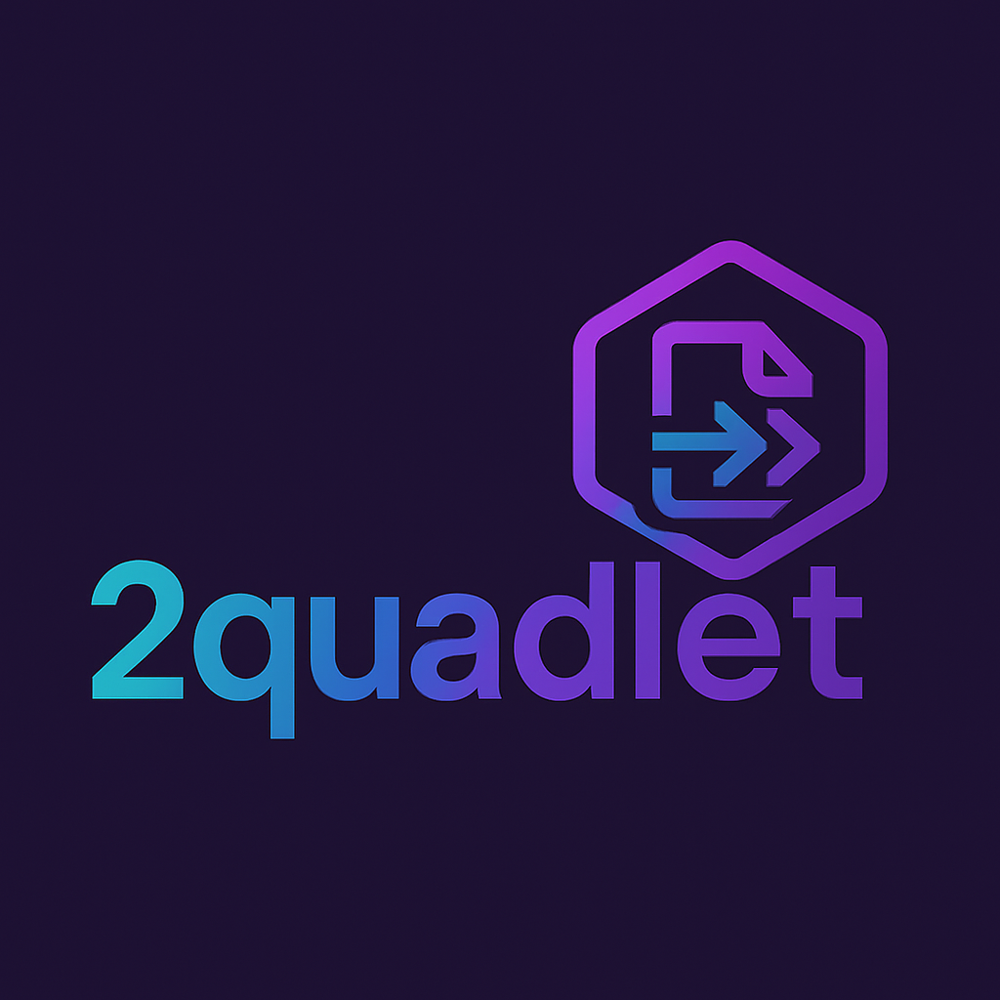
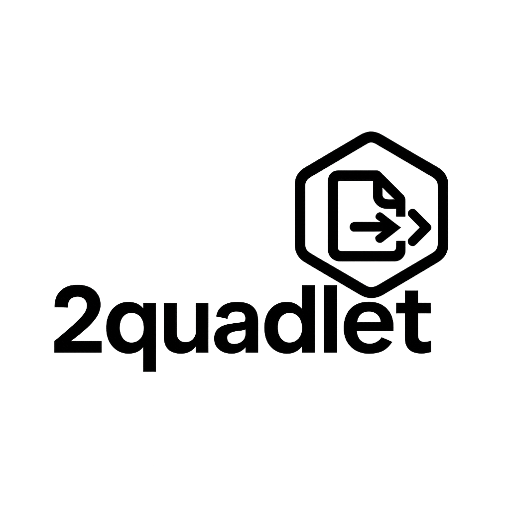

# 2quadlet – Convert Podman Commands and Compose Files to Quadlets

**2quadlet** is a simple and powerful command-line tool that helps you generate [Podman Quadlet](https://docs.podman.io/en/latest/markdown/podman-systemd.unit.html) files from:

- Single `podman run` or `podman create` commands
- `docker-compose.yaml` files

It bridges the gap between development workflows and production-ready systemd service files for containers using **Podman**.

---

## 🚀 Features

- Convert basic `podman run` or `create` commands into valid quadlet `.container` files
- Translate `docker-compose.yaml` into multiple quadlet units
- Output clean, systemd-compliant unit files
- Ideal for creating system services or simplifying container deployment
- Lightweight and fast – perfect for automation or CI/CD

---

## 📦 Installation

Clone the repo and run the tool directly:

```bash
git clone https://github.com/youruser/2quadlet.git
cd 2quadlet
cargo build --release
./target/release/2quadlet --help

